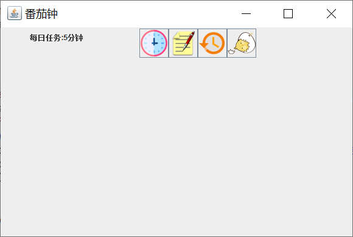

# oop

 Object-oriented programming course.

## Description

This page is created as  the display board of students's team project in 2020.

## Collection
### Project in 2020

- [SCUAssistant](https://gitee.com/Full_Stackecery/ScuAssistant)
  - Description: A crawler-based assistant software.
  - Additional item: [JavaWeb Project](https://github.com/Stakcery/ScuHelper-JavaWeb-)
  - Screenshot:
    
	

- [GroupTestRepo](https://github.com/1TreeForest/GroupTestRepo)
  - Description: An airplane war game.
  - Screenshot:
    暂未上传

- [Tomato Clock](https://github.com/glory1213/java_project)
  - Description: A simple tomato clock for PC version.
  - Screenshot:  
    

- To be continued...
