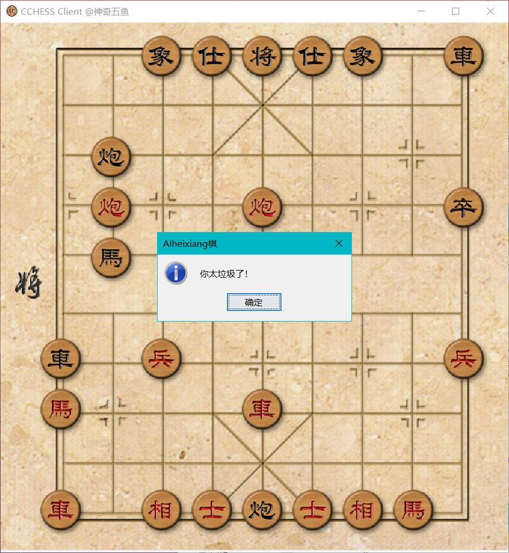

# oop

 Object-oriented programming course.

## Description

This repo is created as  the display board of students's team project.

## Collection

### Project in 2019

- [Hail-Of-Bullets](https://github.com/iishuu/Hail-Of-Bullets)

  - Description: A simple action game.
  - Srceenshot:
    

- [CCHESS](https://github.com/HiramWHL/CCHESS)

  - Description: The interesting Chinese chess.
  - Srceenshot:
    

- [Crazy-Arcade-BNB](https://github.com/HyperMn/Crazy-Arcade-BNB-)
  - Description: A casual game.
  - Screenshot:
    

- [tinyhttp](https://github.com/ChanthMiao/tinyhttp)
  - Description: A simple http server implement in java.
  - Screenshot:
    

- [Bejeweled](https://github.com/Morwind-WYW/3_8match3)
  - Description:  Perhaps the most insanely addictive puzzle game ever.
  - Screenshot:
    

- [Cloudmusic](https://github.com/KingSF5/Cloudmusic)
  - Description: Cache tool for netease music.
  - Screenshot:
    

- [TankWar](https://github.com/HJWinSCU/TankWar)
  - Description: A classic game that we may all played in our childhood.
  - Screenshot:
    

- [game2048](https://github.com/Superrrtan/finalwork)
  - Descriptio: None.
  - Screenshot:
    

- [Bank-Administration-system](https://github.com/dalision/Bank-Administration-system)
  - Description: A simple bank manager system.
  - Screenshot:
    

- [Lottery_System](https://github.com/E-11/Lottery_System)
  - Description: Pick the luck one.
  - Screenshot:
    

- [FiveComBo](https://github.com/Superrrtan/FiveComBo)
  - Description: A simple  gobang game.
  - Screenshot:
    

- [FlightManageSystem](https://github.com/CenturyOYC/FlightManageSystem)
  - Description: The ticks sale system for airport.
  - Screenshot:
    

- [fightwithlandlord](https://github.com/foreverbeatlong/fightwithlandlord)
  - Description: Card game.
  - Screenshot:
    

### Project in 2020

- [SCUAssistant](https://gitee.com/Full_Stackecery/ScuAssistant)
  - Description: A crawler-based assistant software.
  - Additional item: [JavaWeb Project](https://github.com/Stakcery/ScuHelper-JavaWeb-)
  - Screenshot:
    
	
- To be continued...
